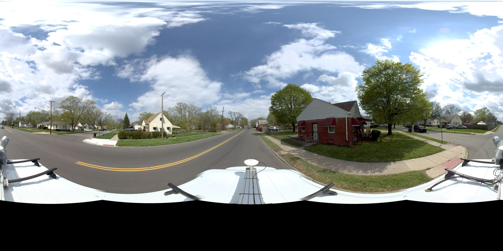
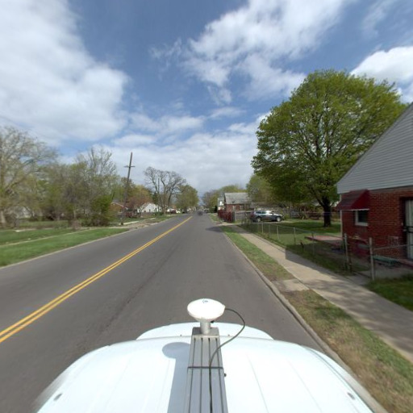
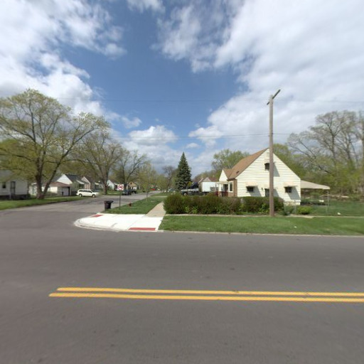
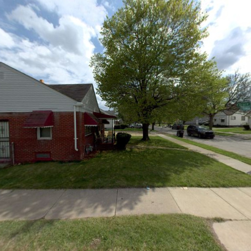
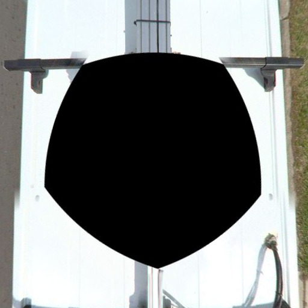
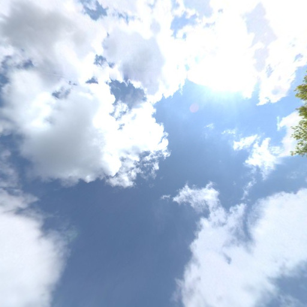
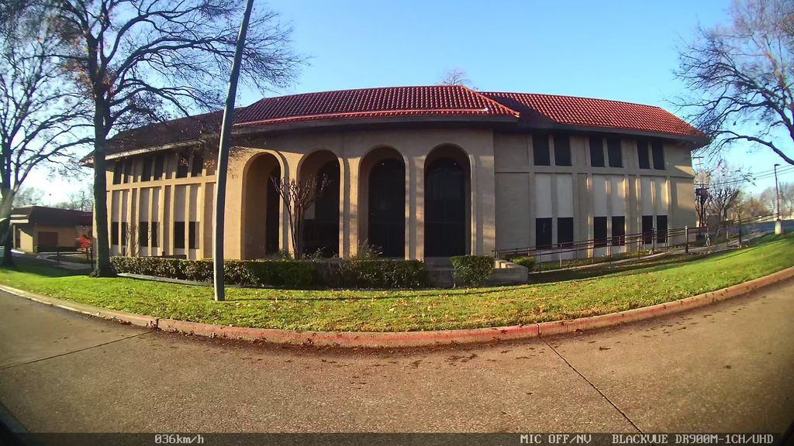

# Spherical to simple side images

Bunch of scripts to process and convert Mapillary spherical images into cube images and then into simple images for specific area in Mapillary API.

## Build container

```sh
export MAPILLARY_ACCESS_TOKEN="MLY|..."
export AWS_PROFILE="xyz..."
docker-compose build
```

### Clip panoramic images into left and right side

This bash downloads panoramic images from Mapillary and converts them into cube images to get the left and right side of the images.

```
bash ./clip_mapillary_pano.sh
```
From the `clip_mapillary_pano` bash:

| COMMAND                 | REQUIRED | DESCRIPTION                                              |
| -----------------       | :------: | -------------------------------------------------        |
| --input_file_points     | yes      | input file path                                          |
| --image_clip_size       | yes      | image size for each image to be clipped                  |
| --output_file_points    | yes      | output file path                                         |
| --output_images_path    | yes      | output images path                                       |
| --cube_sides            | yes      | sides of the image to save                               |

**Note**: For converting spherical-pano image to cubemap image, we are using [py360convert](https://github.com/sunset1995/py360convert):

#### Example of images:

- Mapillary spherical panoramic image



- Cube images from the spherical panoramic image

|               Front                |                Back                |
| :--------------------------------: | :--------------------------------: |
|  |  |

|               Left                |               Right                |
| :-------------------------------: | :--------------------------------: |
|  |  |

|               Under                |               Over                |
| :--------------------------------: | :-------------------------------: |
|  |  |


### Download and lens correction of non-panoramic images 

This bash downloads non-panoramic images from Mapillary and fixes the fisheye effect of the images.

```
bash ./lens_correction_no_pano.sh
```
From the `lens_correction_no_pano` bash:

| COMMAND                 | REQUIRED | DESCRIPTION                                              |
| -----------------       | :------: | -------------------------------------------------        |
| --input_points          | yes      | input file path                                          |
| --output_images_path    | yes      | output images path                                       |
| --s3_url                | yes      | http url to s3 public bucket                             |
| --output_points         | yes      | output file path                                         |
   

#### Example of images:

- Original non-panoramic image from Mapillary



- Fisheye effect fixed 


